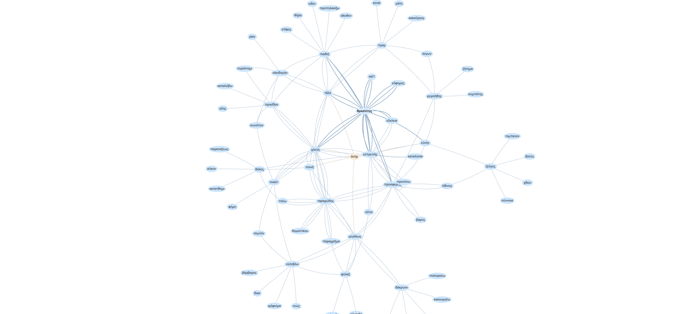

# Ancient greek word2vec

This is a latent space for ancient greek trained on 149883 sentences from [First1K project]( https://chs.harvard.edu/the-free-first-thousand-years-of-greek-qa-with-leonard-muellner/).

The vocabulary was lemmatized (534258 words + 96443 words not lemmatizable). 10,25,50,75,100 and 300 dimensions latent space are provided (gr...vec). As a comparison another model is proposed (Nov22_RW) based on this [repo](https://github.com/ryderwishart/ancient-greek-word2vec).

# Online demonstration

## Running a binder instance

## Graph Output sample
[Display a sample graph](https://l0d0v1c.github.io/Ancient-greek-word2vec/ponos.html) : This page is an example of graph output. Nodes are double-clickable to query the dictionary.

## Precomputed standalone
A precomputed app for 300 dimensions latent space and 10 closest words baed on the 20000 most frequent greek words is available but only allow to display the graph, not distances calculations.
[access to the app](https://l0d0v1c.github.io/Ancient-greek-word2vec/graph.html) 

# References

Řehůřek, Radim, et Petr Sojka. « Software Framework for Topic Modelling with Large Corpora ». In Proceedings of the LREC 2010 Workshop on New Challenges for NLP Frameworks, 45‑50. Valletta, Malta: ELRA, 2010.

Crane, Gregory R., Leonard Muellner, Bruce Robertson, Alison Babeu, Lisa Cerrato, Thomas Koentges, Rhea Lesage, Lucie Stylianopoulos, et James Tauber. « First1kGreek ». Zenodo, 22 août 2022. https://doi.org/10.5281/ZENODO.7015940

https://github.com/ryderwishart/ancient-greek-word2vec

